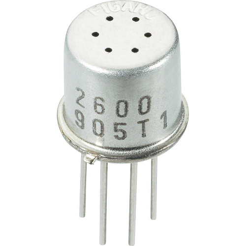
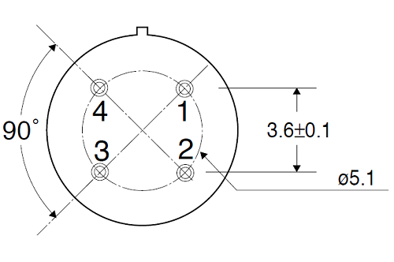
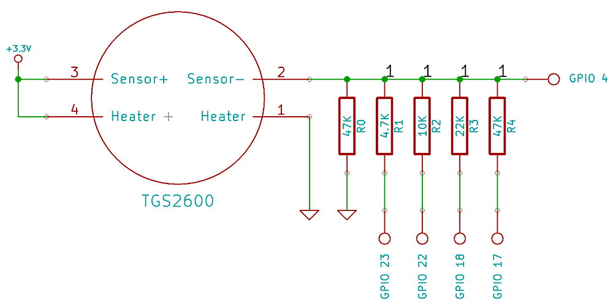
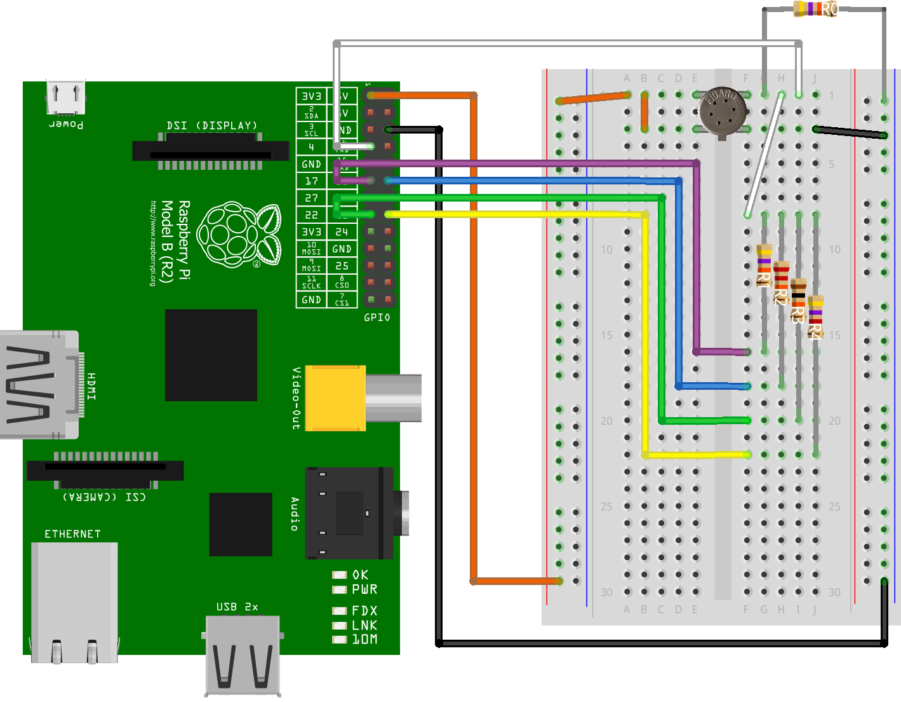
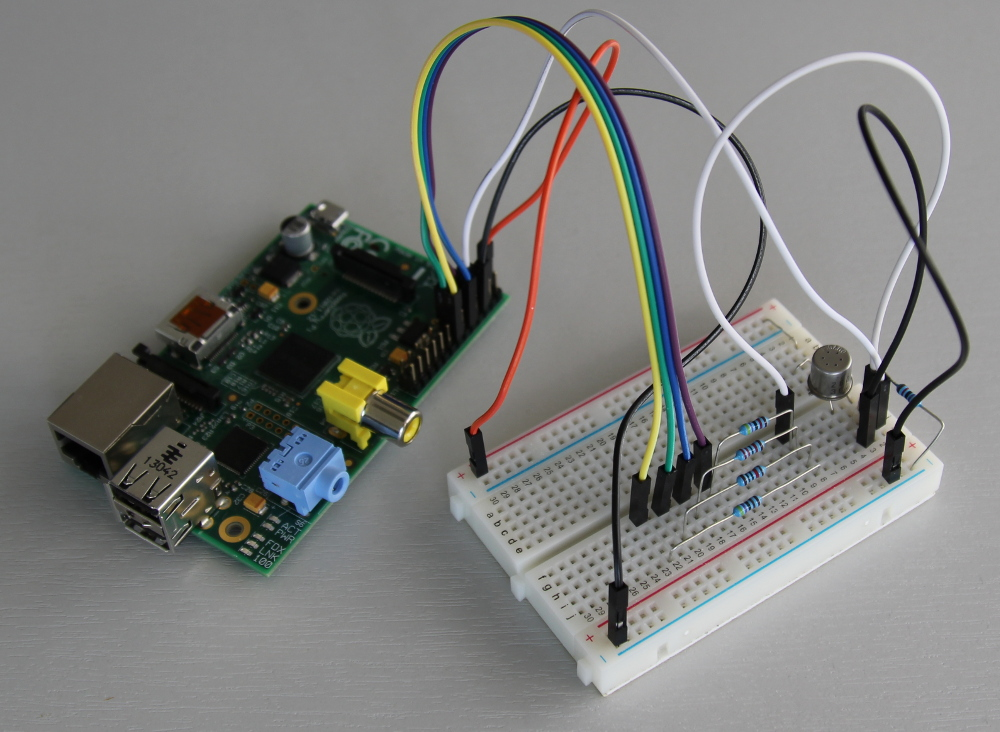
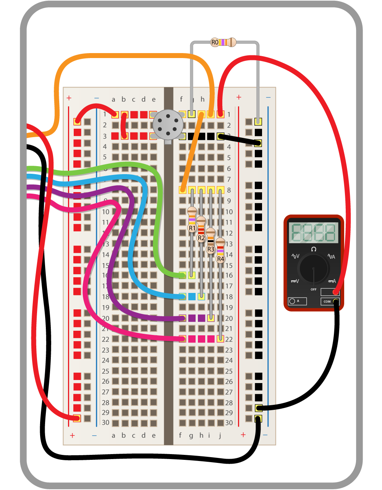

## Introduction


### How can we detect a fart?

Flatulence or *farts* are essentially gasses that are produced in the stomach and bowels by bacterial fermentation during the process of digestion. The scientific study of farts and fart gases is known as *flatology*, a future career for some of you perhaps? It is perfectly normal for human beings to pass wind every day although the amount varies greatly between individuals, it can range from a tiny amount up to and in excess of two litres.

You'll be surprised to learn that 99% of fart gasses do not smell at all. These include oxygen, nitrogen, carbon dioxide, hydrogen and methane. The remaining 1% is what gives farts their smell and these are mostly volatile sulphuric compounds. The same stuff that makes rotten eggs smell.

To detect a fart with the Raspberry Pi we need to use a sensor that is responsive to one or more of these gasses. Essentially we need to give the Raspberry Pi a *nose*. The sensor recommended for this project is the Figaro TGS2600 and costs around £10.

Here is a close-up of it:



Firstly it is important for us to understand how this sensor works. The sensor is designed to measure air quality or rather how *contaminated* the air is. The datasheet for those of you who want it can be found [here](http://www.figarosensor.com/products/2600pdf.pdf).

To summarise it has six holes to allow air to go inside. The air is then energised by a small heater which allows its electrical resistance to be measured. This is done by passing a low level of electricity across a small gap of energised air. Generally speaking the more contaminated the air is the less resistance it has and the better it will conduct electricity (like a variable resistor). The output of the sensor is therefore an analogue voltage that goes up and down according to how contaminated the air is. The more contaminants the higher the voltage output.

### Analogue vs Digital


We also need to understand that the air quality sensor gives us an *analogue* signal. So let's look at what analogue means as opposed to digital as a concept. Digital signals are essentially binary 1 or 0, on or off. Analogue signals have the full range *between* on or off. Think of a car steering wheel. The wheel is analogue because you have a full range of steering available to the driver. You can steer very gently around a long sweeping corner, you can turn the wheel to full lock or anywhere in between. If you wanted to steer a car digitally you would basically have full lock left and full lock right only, like steering using the indicator stick.

Those of you who play computer games may have experienced this before. Look at your control pad and consider the differences between the use of the analogue thumb joystick and the digital D-pad in the games that you play. Analogue and digital both have their place and often one works better for a particular task than the other. For a game like a flight simulator you would want analogue control to aim the plane, whereas for something simple like a jump, run and shoot platform game digital control is better.

I expect you can think of further examples of analogue and digital beyond just these.

### But the Raspberry Pi is digital?


So the challenge we face is being able to read an *analogue* signal on a *digital* computer. The Raspberry Pi GPIO pins can be used as inputs or outputs. Output mode is for when you want to supply voltage to something like an LED or a buzzer. If we use input mode, a GPIO pin has a value that we can read in our code. If the pin has voltage going into it, the reading will be `1` (*HIGH*); if the pin was connected directly to ground (no voltage), the reading will be `0` (*LOW*). So they are digital allowing only `1` or `0`.

How can we solve this? One way would be to use an ADC chip ([Analogue to Digital Converter](http://en.wikipedia.org/wiki/Analog-to-digital_converter)) or something like an [Arduino](http://arduino.cc/en/Main/Products). By connecting the output of the air quality sensor to the input of an ADC we can convert the analogue voltage from the sensor to a digital number in our code.

However this does complicate matters slightly. You would only need to use an ADC if a really accurate reading from the sensor was needed, for example if you wanted to know how many [parts per million](http://en.wikipedia.org/wiki/Parts-per_notation) of methane was present. In practise we just want to make an alarm go off when a fart has been detected so everyone can run! So if you think about it... this is a digital detection. There *is* a fart. There *is no* fart. On or off, binary 1 or 0. We can get away without having to worry about the analogue fidelity coming from the air quality sensor.

We already know that the sensor is like a variable resistor, the worse the air quality the lower the resistance and the more voltage is let through. So logically when the sensor comes into contact with a fart the output voltage should spike. Therefore we just need to detect these voltage spikes and that *can* be done digitally. We can make it so that when a spike occurs a GPIO pin goes from LOW to HIGH, we can then detect this change in our code and play an alarm sound file!

### The high and low threshold

You now might be wondering how the Raspberry Pi knows if a GPIO pin is HIGH or LOW?

The answer to this question is actually part of our solution. You may already know that the GPIO pins work at 3.3 volts. So if you set a pin to be HIGH in output mode that pin will give/supply 3.3 volts. If you set it to output LOW though it will be connected to ground but could form the return path for completing a circuit.

In input mode things work slightly differently. Naturally you would assume that the reading of the pin would be HIGH if it was connected to 3.3 volts and LOW if connected to ground. There is actually a voltage *threshold* that lies somewhere around 1.1 to 1.4 volts. The actual threshold varies slightly between different hardware revisions of the Raspberry Pi (but we can cope with this). Below the threshold is LOW and above it is HIGH. So for example 1.0 volt would read LOW, despite there actually being some voltage there where as 1.6 volts would read HIGH despite this being a lot less than 3.3.

This is quite a hacky way to do it but if we use some resistors to bring the output voltage of the air quality sensor down to *just below* this threshold then the spike caused by a fart will tip it over from LOW to HIGH and we have our digital fart detection.

## Step 0: Setting up your Pi

First check that you have all the parts you need to get your Raspberry Pi set up and working.

- Raspberry Pi
- Micro USB power adaptor
- An SD card with Raspbian already set up through NOOBS
- USB keyboard
- USB mouse
- HDMI cable
- A monitor or TV

### Activity checklist:

1. Place the SD card into the slot of your Raspberry Pi.
1. Next connect the HDMI cable from the monitor or TV.
1. Plug in the USB keyboard and mouse.
1. Plug in the micro USB power supply.
1. When prompted to login type:

    ```bash
    Login: pi
    Password: raspberry
    ```

## Step 1: Wire up the Air Quality sensor



This is the **bottom** view... the pin numbers have the following functions:

1. Heater (-)
1. Sensor electrode (-)
1. Sensor electrode (+)
1. Heater (+)

So there are two distinct circuits that we need to accommodate. First is the *heater* (pins 1 and 4) which is used to energise the air and the other is the *sensor* itself (pins 2 and 3). The output (-) side of the sensor is where we'll be doing our hacky trick with a GPIO pin threshold. Take the breadboard and push the four pins of the sensor into it so that it straddles the central gap as shown below. You may need to bend the pins a little, this will not harm the sensor. Ensure the little tab is in the same orientation as shown.

*Note:* On a breadboard like this the holes on the outside are connected *vertically* and on the inside they're connected *horizontally*. Look at the green highlighting in the diagram.


The sensor can run on 5 volts but we're going to run it on 3.3 volts here since this is safer for use with a GPIO input. Use the jumper wires to make the orange connections shown above, this will supply 3.3 volts to pins 3 and 4 of the sensor (both positive electrodes). The colour of the wire you use doesn't matter. Next connect the negative (-) terminal of the heater directly to ground as shown above by the black wires.

We still need to do something with the negative side of the sensor, row 1 in the top right corner of the breadboard. See below.

## Step 2: Wire up the trigger pin

Shut down the Raspberry Pi and unplug the power for now, we'll plug it back in again later.

`sudo halt`

Next let's connect the output of the sensor to one of the GPIO pins, this will be the *trigger* pin which we will monitor in our code to see if a fart has occurred. Use GPIO 4 for this (or pin number 7 if you're counting horizontally from the top). Take a jumper wire and make the white connection shown below.


Next take a 47kΩ resistor (resistors are [colour coded](http://en.wikipedia.org/wiki/Electronic_color_code#Resistor_color-coding) to help you identify them) and connect it between the sensor output and ground as shown above. This will essentially siphon off a portion of the voltage coming from the sensor output to help bring it down to the (1.1 to 1.4 volt) region of the GPIO threshold for our trigger pin. This single resistor is not going to be enough to get the job done though, read on.

## Step 3: Build a resistor ladder DAC

The problem we now have is that despite the addition of the 47kΩ resistor the air quality sensor has quite a large output voltage range. 0 volts would be in a vacuum (no air, e.g. space) and the maximum 3.3 would be in a terrible, eye watering, silent but deadly fart. Depending on the background quality of the air the output voltage of the sensor can be anywhere within that range. So we need a reliable way to always bring that voltage down to just below the GPIO threshold under different air quality conditions.

To do this we need *another* variable resistor, so that we can vary the amount of voltage that we siphon off to ground. We could use a [potentiometer](http://en.wikipedia.org/wiki/Potentiometer) for this but you would always need to manually tune it to the background air before it could be used. This is not ideal if you want to set the trap and wait for an unsuspecting victim. The background air quality can change naturally in the mean time and thus the alarm might go off without a fart. Awkward.

It would be a lot better to have control of this from within our code. Then we can program it to keep adjusting to the background air quality and the trap would not need manual intervention if the air quality changed.

A clever trick we can use here is the [resistor ladder](http://en.wikipedia.org/wiki/Resistor_ladder). This is where we have a set of repeating resistors that we can independently turn on and off in our code. If each resistor has a different value in ohms we can use different combinations of them to give us something which approximates the behaviour of a variable resistor / potentiometer.

### The theory

This next section might seem a bit boring but the topics covered will tremendously help your understand of the project so I advise to not skip it!

Look at the diagram below. This *schematically* shows how a resistor ladder would be connected to the TGS2600 air quality sensor. So essentially the output voltage of the sensor is coming out of pin number `2` and this is connected to GPIO 4. However in between that we have several places where we can siphon off voltage to bring the voltage down to the GPIO pin threshold as required.



So far only the 47kΩ `R0` is present on your breadboard which is hard wired directly to ground. The other resistors (`R1` to `R4`) are each connected *in parallel* to a different GPIO pin. This gives us digital control over whether each resistor is on or off. If we configure the GPIO pin to use `INPUT` mode this switches the resistor off because the GPIO pin is not internally connected to anything. However if we set it to use `OUTPUT` mode and then drive the pin LOW this will connect the resistor to ground and thus some voltage will be siphoned off through it.

A note about [parallel resistors](http://en.wikipedia.org/wiki/Series_and_parallel_circuits#Resistors_2). The total resistance of the ladder is *not* the sum of all the resistors that are turned on. It would be if you wired the resistors in series though, that's because the voltage would need to flow through each resistor in turn. In parallel the flow of voltage will divide equally among each resistor and the effect is that the total resistance *is less*. So the more resistors we turn on the lower the total resistence will be and the more voltage gets siphoned off to ground.

Since the ladder is controlled digitally by turning resistors on and off but effects an analogue voltage (from the sensor) the circuit can be called a [digital to analogue converter](http://en.wikipedia.org/wiki/Digital-to-analog_converter) or DAC for short. This is the opposite of an ADC mentioned earlier.

Ideally we need to vary the resistance in a linear way and have a good number of possible on/off combinations that will accommodate the range of the air quality sensor output voltage. Consider what would happen if all the resistors had the same value in ohms, how many possible *unique* combinations of resistance values could there be?

The answer is only 5. Look at the table below:

R1 | R2 | R3 | R4 
--- | --- | --- | ---
x | x | x | x
ON | x | x | x
ON | ON | x | x
ON | ON | ON | x
ON | ON | ON | ON

This is problematic since it doesn't give us much of a range to choose from, there are only 5 possible steps. It might work but it would be quite hard to bring the voltage down to the GPIO threshold correctly every time. However if we used *different* resistance values for `R1` to `R4` then we could combine them many more ways affording more combinations. We could borrow from the [binary counting system](http://en.wikipedia.org/wiki/Binary_number#Counting_in_binary) here? So that each resistor represents a binary digit with an associated bit significance/magnitude in ohms.

8's | 4's | 2's | 1's
--- | --- | --- | ---
`0` | `0` | `0` | `0`

In binary each digit position has twice the value of the position to the right. So the right most column is 1's, the next colum is 2's, then 4's and so on. Look at the table above. So to represent the number *3* you need one lot of 2 and one lot of 1, so the decimal number 3 in binary is `0011`. The decimal number *9* is one lot of 8 and one lot of 1 giving `1001`.

This would then give us 16 on/off combinations (if we include zero). Look at the table below:

Decimal | Binary
--- | ---
0 | `0000`
1 | `0001`
2 | `0010`
3 | `0011`
4 | `0100`
5 | `0101`
6 | `0110`
7 | `0111`
8 | `1000`
9 | `1001`
10 | `1010`
11 | `1011`
12 | `1100`
13 | `1101`
14 | `1110`
15 | `1111`

In a perfect world the resistance values for `R1` to `R4` should mirror binary bit significance. The term *bit significance* refers to the value or magnitude that each bit position has. For example in a 4 bit number the right most bit has a value of only 1 and is called the [least significant bit](http://en.wikipedia.org/wiki/Least_significant_bit) or **LSB** for short. The left most bit has a value of 8 and is the [most significant bit](http://en.wikipedia.org/wiki/Most_significant_bit) or **MSB** for short.

We need to think carefully now. Consider the amount of voltage that each resistor lets through. The higher the resistance in ohms the *less* voltage is let through and conversely the lower the resistance value the *more* voltage is let through. Remember a normal wire has almost no resistance and lets *all* voltage though. Given this we ought to assign the least significant bit to have the *highest* resistance since this lets through the least voltage and the *lowest* resistance to the most significant bit since this lets through the most voltage. For example:

8's MSB | 4's | 2's | 1's LSB
--- | --- | --- | ---
R/8 | R/4 | R/2 | R

The actual values we're going to use are below. These have been chosen for their ubiquity and to make it easier for you to buy / obtain the physical resistors. You'll notice that they do not *perfectly* mirror binary bit significance but they will be good enough for this project.

8's MSB | 4's | 2's | 1's LSB
--- | --- | --- | ---
4.7k | 10k | 22k | 47k 

Take another look at the schematic diagram above, you'll see that there is a row of 1's to represent the four bit binary number that will be the on/off state of the ladder (it shows `1111` which is 15). So in our code we'll start the ladder at `0000`. With all the resistors turned off the output voltage will be much higher than the GPIO threshold and so the trigger pin (GPIO 4) will read HIGH. We then incrementally work our way up to 15 `1111`. On each step we decrease the resistance (or increase the amount of voltage siphoned off to ground) and check to see if GPIO 4 has gone from HIGH to LOW. Once we have found the HIGH/LOW threshold the air quality sensor is then calibrated to normal air and any increase in output voltage (caused by a fart) should be enough to tip the trigger pin back from LOW into HIGH. We then just need to wait for this to happen in our code and then sound the alarm!

### The practise

Okay so let's go ahead and wire up the resistor ladder on our breadboard. Here is a quick reference table for the resistor values that you need to use and what pins they should be connected to:

R0 | R1 | R2 | R3 | R4
--- | --- | --- | --- | ---
47k | 47k | 22k | 10k | 4.7k
GND | GPIO 17 | GPIO 18 | GPIO 22 | GPIO 23

The resistor [colour bands](http://en.wikipedia.org/wiki/Electronic_color_code#Resistor_color-coding) will match those on the diagram below. Use the jumper cables to make the connections shown and remember the colour of the wire does not matter. You'll notice a jumper needs to go between H1 and F8 on the breadboard. This is just to expand the number of holes that are connected to pin 2 of the air quality sensor and allows us to t-off each of the resistors that make up the ladder.



When you're done you should have something like this. You'll notice that for some of the connections we have just used bare wire (instead of a jumper) pushed flat to the breadboard. This can be a nice way of keeping things tidy but either way will work fine.



We have now completed the hardware side of the project, we just need to bring it to life with some programming!

## Step 4: Play a test alarm sound

Plug your Raspberry Pi back in, boot up and log in as per usual. If you are using headphones or a speaker on the Raspberry Pi, you will need to run the following terminal command to redirect sound to the headphone socket:

`sudo amixer cset numid=3 1`

Next we're going to use the Python pygame library to make some alarm sounds. First verify that the package is installed using the following command:

`sudo apt-get install python-pygame -y`

If your SD card is up to date you should see the message:

`python-pygame is already the newest version`

Lets first download a sound file that will be the alarm. This is essentially a robotic voice saying "evacuate", enter the following terminal command to download it.

`wget https://raw.githubusercontent.com/raspberrypilearning/fart-detector/master/sounds/evacuate.mp3 --no-check-certificate`

Okay, now let's do some programming. Enter the following command to start editing a blank file:

`nano farts.py`

Now either copy and paste or enter the following code:
```python
#!/usr/bin/python
import time

from pygame import mixer
mixer.init()
mixer.music.load("evacuate.mp3")

mixer.music.play(-1) # -1 to loop the sound
time.sleep(10) #let it play for 10 seconds
mixer.music.stop()
```
This code uses the pygame mixer to load a sound file and play it in a loop for 10 seconds.
Press `Ctrl - O` then `Enter` to save followed by `Ctrl - X` to quit.

Next, mark the file as executable with the following command:

`chmod +x farts.py`

Now we can run the code; when you do, the alarm should play for 10 seconds and then stop.

`./farts.py`

## Step 5: Write code to calibrate the ladder

As stated above we need to calibrate the ladder to bring the output voltage of the air quality sensor down to just below the threshold of the trigger pin so that it reads LOW. That way any increase in output voltage caused by a fart will tip the trigger from LOW into HIGH (which we can easily detect in code).

Lets continue editing our program. Enter the following command:

`nano farts.py`

Remove the three lines below, these are no longer needed but will be used again later.
```python
mixer.music.play(-1) # -1 to loop the sound
time.sleep(10) #let it play for 10 seconds
mixer.music.stop()
```
Next we need to import the GPIO library. This allows us to configure the GPIO pins as desired.
Add `RPi.GPIO as GPIO` at the top of the file as shown below:
```python
#!/usr/bin/python
import time, RPi.GPIO as GPIO

from pygame import mixer
mixer.init()
mixer.music.load("evacuate.mp3")
```
We now need to set up the trigger pin (GPIO 4) as an input. We can create variable called `TRIGGER` which will hold the the number 4, we can then refer to this variable everywhere else in the code when we access the trigger pin.
```python
TRIGGER = 4

GPIO.setmode(GPIO.BCM) #use BCM pin layout
GPIO.setup(TRIGGER, GPIO.IN)
```
The `GPIO.setmode` line above configures the GPIO library to use the Broadcom pin layout which matches the graphic in the breadboard diagrams above. Then the `GPIO.setup` line actually configures the trigger pin to be an `INPUT`, that allows us to read the state of it to test if it is HIGH or LOW. The next task is for us to loop through all the possible on/off combinations for the ladder (0 to 15 in binary) and locate the threshold of this trigger pin.

So the algorithm will be something like:

- Loop for each number between 0 to 15
    - Configure the laddder to the binary form of the number
        - if GPIO 4 is LOW
            - Exit loop
- Wait for GPIO 4 to go HIGH
    - Sound fart alarm

If we break this task down there are three things we need to do.

- Turn resistor pins on and off
- Set all resistor pins in the ladder to represent a binary value
- Loop between 0 and 15 to calibrate the ladder DAC

### Turn resistor pins on and off

In order to switch a resistor on or off we just use the `GPIO.setup` command with different parameters. If the resistor/pin is *on* we configure the pin to use `OUTPUT` mode and drive it LOW. This will connect the pin to ground and some voltage will then flow from the sensor output through to ground. If the sensor is *off* we just configure the pin to use `INPUT` mode which means the pin is not connected to anything and nothing will flow through it.

We can define a function called `set_pin` as follows to do this, enter or copy and paste this into your code.
```python
def set_pin(pin, ison):
    if ison:
        GPIO.setup(pin, GPIO.OUT)
        GPIO.output(pin, GPIO.LOW)
    else:
        GPIO.setup(pin, GPIO.IN)
```
The function takes two parameters `pin` and `ison`. The `pin` parameter will be the GPIO pin number and `ison` will be a boolean (True/False) variable to say which state (on or off) the resistor/pin should be. We then just use an `if` statement and call the appropriate GPIO commands passing in `pin`. When we call the function we can write `set_pin(18, True)` for example.

### Set all resistor pins in the ladder to represent a binary value

Next we need a function to call `set_pin` multiple times for each of the ladder GPIO pins (17, 18, 22 and 23).
Since we're setting the entire ladder DAC we can define a function called `set_dac` to do this, enter or copy and paste this into your code.
```python
def set_dac(bitwise):
    set_pin(17, bitwise & 1 == 1)
    set_pin(18, bitwise & 2 == 2)
    set_pin(22, bitwise & 4 == 4)
    set_pin(23, bitwise & 8 == 8)
```
The function takes one parameter called `bitwise`. Because each resistor/pin represents a binary bit position we now need to call the `set_pin` function accordinly based on whether or not the corresponding binary bit is set to `1` in `bitwise`.

8's MSB | 4's | 2's | 1's LSB
--- | --- | --- | ---
GPIO 23 | GPIO 22 | GPIO 18 | GPIO 17
4.7k | 10k | 22k | 47k

For example if `bitwise` was 9, this is `1001` in binary so working from LSB to MSB (right to left):
- `1` = `GPIO 17` ON
- `0` = `GPIO 18` OFF
- `0` = `GPIO 22` OFF
- `1` = `GPIO 23` ON

If we do a logical [and](http://en.wikipedia.org/wiki/Bitwise_operation#AND) between `bitwise` and the value of the bit position we can test to see if a bit is set to `1` or not. It works by comparing the bit positions of both numbers, if they are `1` in both then the answer will also be `1` otherwise its `0`.

For example, testing the number 5 for the first bit (LSB):
```
    0101 (decimal 5)
AND 0001 (decimal 1)
  = 0001 (decimal 1)
```
Another example, testing for the right most bit (MSB):
```
    1101 (decimal 13)
AND 1000 (decimal 8)
  = 1000 (decimal 8)
```
We can use [bitwise operators](https://wiki.python.org/moin/BitwiseOperators#The_Operators:) to do this in our code. So if we use `bitwise & x == x` (bitwise and x is equal to x) this will give a boolean (True/False) result depending on whether the bit `x` is set or not. Take another look at the `set_dac` function now and you'll notice that we use this trick to call the `set_pin` function multiple times for each bit value/position. This ensures that the `ison` parameter inside the `set_pin` function will always be True or False.

When we call the `set_dac` function we can write `set_dac(x)` for instance. Where x is a number between 0 and 15.

### Loop between 0 and 15 to calibrate the ladder DAC

Okay so now that we have the ability to configure the DAC we need some code that will loop from 0 to 15 calling `set_dac` and testing the input trigger pin to find the HIGH to LOW threshold.

Let's call this function `calibrate`, enter or copy and paste this into your code.
```python
def calibrate(trace = False, sleep_time = 0):
    result = -1
    for i in range(0, 16):
        set_dac(i)
        if trace:
            print i, "{0:b}".format(i) #binary format
        time.sleep(sleep_time)
        if not GPIO.input(TRIGGER):
            result = i
            break
            
    return result
```
The function takes two parameters, `trace` and `sleep_time`. The `trace` parameter is a boolean (True/False) value to say if we want to trace/print the ladder steps we're working through. The `sleep_time` parameter specifies how long the code should pause for between configuring the DAC and taking the measurement from the trigger pin. You'll notice that they are both *optional* parameters since we provide a default value for them.

Inside the function then we define a variable called `result`. This will be returned at the end of the function so that the main program can know which step on the ladder (between 0 and 15) the threshold was found. Next is a `for` loop for the range 0 to 16. Why 16? In python you specify the number to start at and the number to stop at, so stopping at 16 means 15 will be the last time around the loop. The syntax `for i in range` means that the variable `i` changes each time around the loop.

Inside the loop then we pass `i` into `set_dac`, we then print out what ladder step we're on (in both decimal and binary), sleep as necessary and then test the value of the trigger pin using the `GPIO.input` command. This command will return `1` for HIGH or `0` for LOW. We can then use the `if not` syntax to test whether `0` was returned. If we get `0` then we've found the HIGH to LOW threshold step so we set `result = i` and `break` out of the loop.

It is possible that the air quality could be so *bad* that the threshold is never found (it can get this way if you abuse the deodorant can or fart in a confined space). In this case `result` will still be `-1` and will end up being the return value of the function. This allows the main code to know if the calibration was successful or not. When the calibration is unsuccessful you can only wait for the air to clear and try again. You can always print a message about the fart lingering though!

Right, now let's program the main code that will use the `calibrate` function!

Enter or copy and paste this code at the very bottom of your file.
```python
fresh_air = calibrate(trace = True, sleep_time = 0.5)

if fresh_air != -1:
    print "Calibrated to", fresh_air
else:
    "Could not calibrate"
```
This calls the calibrate function and stores the result in a variable called `fresh_air`, under normal conditions this should be somewhere below 6 or 7. We can then use an `if` statement to test if `fresh_air` is equal to `-1` or not. So if not equal `!=` to `-1` then we have a successful calibration, otherwise it failed.

Lets run the code. Press `Ctrl - O` then `Enter` to save followed by `Ctrl - X` to quit from editing.

GPIO functions require root access on your Pi, so from now on you must use the `sudo` command to run your code. If you don't use sudo you'll see the following error: `No access to dev/mem. Try running as root!`

`sudo ./farts.py`

The output should look something like this:
```
0 0
1 1
2 10
3 11
4 100
Calibrated to 4
```
*Note:* it's important to remember that the heater in the air quality sensor needs to have warmed up before this will work. So if you turn off your Pi now and come back to this later you may need to wait a few minutes for the heater to warm up from cold before you can get a successful calibration.

If it goes all the way up to 15 and you see the `Could not calibrate` message then just wait a minute or two and run the code again.

### Optional activity using a multimeter

If you connect a Multimeter to the breadboard as shown (and configure it to display voltage) you will be able to observe the voltage level changing in real time as the calibration code runs. You may need to use some Male to Male jumper wires and then the help of a friend to hold the multimeter terminals onto the bare ends of the jumper wires.



If you want the calibration to run more slowly, to give you more time to see the values on the multimeter, then you can just increase the `sleep_time` parameter on the call to the `calibrate` function on the line below:

`fresh_air = calibrate(trace = True, sleep_time = 0.5)`

Try `1.5` instead of `0.5` and see how that looks. Run the code again with `sudo ./farts.py` when you're ready.

When you're doing this bear in mind that the HIGH vs LOW threshold for a GPIO pin is around 1.1 to 1.4 volts. The expected result is for the voltage to start around 2 to 3 volts with it dropping in stages until it reaches the threshold. When the GPIO pin goes LOW you should see the `Calibrated to x` message on the screen.

## Step 6: Monitoring for farts and raising the alarm

Now that we have successfully calibrated the sensor in normal air we can add some code to wait for the trigger pin to go from LOW to HIGH whereupon we can play the alarm sound. Lets continue editing our program.

`nano farts.py`

We should add code directly after the line `print "Calibrated to", fresh_air` so that it will only run if we have a successful calibration. Look at the code below and modify yours to match it.
```python
fresh_air = calibrate(trace = True, sleep_time = 0.5)

if fresh_air != -1:
    print "Calibrated to", fresh_air
    
    print "Waiting for fart..."

    while not GPIO.input(TRIGGER): #wait as long as trigger is LOW
        time.sleep(.1)

    fart = calibrate(sleep_time = 0.1) #quickly recalibrate to get the fart level

    if fart > fresh_air or fart == -1:
        print "Fart level", fart, "detected!"
        
        mixer.music.play(-1) # -1 to loop the sound
        time.sleep(10) #let it play for 10 seconds
        mixer.music.stop()
else:
     print "Could not calibrate"
```
So firstly we use a while loop with the syntax `while not GPIO.input(TRIGGER)` with a sleep inside the loop. This will hold up the code from progressing onto the lines below while the trigger pin reads `0` LOW. Queue a fart and the output voltage of the sensor should increase enough for the trigger pin to go back into HIGH which will cause the loop to exit. We can then *reuse* the `calibrate` function as a clever way to measure the fart potency!

So we call the `calibrate` function again but we pass in a 0.1 second `sleep_time` parameter because we want to do this quickly in order to sound the alarm. The result of this we store in a variable called `fart` so that we can compare it to `fresh_air`. We should only sound the alarm if `fart` is greater (worse air quality) than `fresh_air` or if fart was a failed calibration meaning the air quality can't get any worse. So we use the `if fart > fresh_air or fart == -1` syntax to do this and inside the `if` statement we can print out the level of the fart and put the three lines of code to play the alarm sound for ten seconds.

I have observed, on occasion, the trigger pin being precisely on the threshold and fluctuating between HIGH and LOW. So there is a possible case where the while loop will exit but `fart` turns out no higher than `fresh_air`. In this case the program would exit without playing the alarm.

Lets run the code. Press `Ctrl - O` then `Enter` to save followed by `Ctrl - X` to quit from editing.
Remember to use the `sudo` command when you run the code.

`sudo ./farts.py`

The output should look something like this:
```
0 0
1 1
2 10
3 11
4 100
Calibrated to 4
Waiting for fart...
```
I would suggest to use a deodorant can to test that the air quality sensor is working. Most deodorants use a gas called Isobutane which you should find listed under the ingredients on the side of the can. Fortunately the TGS2600 sensor is very sensitive to Isobutane (see the [data sheet](http://www.figarosensor.com/products/2600pdf.pdf)) so this gives us a pretty good way to simulate farts on demand. In addition to Isobutane the TGS2600 is also sensitive to Hydrogen as well as Methane. Hydrogen in particular can be up to 50% of the gas that makes up a fart.


You only need a very small squirt to set it off, so spray some in the general direction of the sensor and wait. The message `Fart level x detected!` should appear and the *evacuate* alarm should go off. If you get a `-1` then you probably sprayed too much, you may need to wait a bit to be able to successfully calibrate the next time you run the code.

## Step 7: Continuous monitoring and recalibration

You'll notice that currently the program will only wait for one fart, sound the alarm and then exit. It may be that you want to set this up in a semi permanent way to provide an early warning system in the home? It would be better if the program would sound the alarm for a while and then try to recalibrate to wait for another fart.

The [data sheet](http://www.figarosensor.com/products/2600pdf.pdf) also says that the sensor has a dependency to temperature and humidity. This will manifest as the output voltage of the air quality sensor shifting under normal air conditions. What could potentially happen is that our ladder calibration level becomes wrong as conditions change throughout the day causing the alarm to go off on its own without a fart. To mitigate this we can put a timeout in our code to force a recalibration to run every two minutes.

Lets continue editing our program.

`nano farts.py`

The first problem is easily to solve, all we have to do is enclose our current code in a while loop and perhaps add a 5 second sleep where we were unable to calibrate (to wait for the air to clear or the sensor heater to warm up).

Then we need to limit how long we wait while the trigger pin is LOW. To measure time in code you have to record the time now, wait for something to happen, and then subtract the time you recorded from the current time. Take a look at the code below:
```python
while True:
    fresh_air = calibrate(trace = True, sleep_time = 0.5)

    if fresh_air != -1:
        print "Calibrated to", fresh_air
        start_time = time.time()

        print "Waiting for fart..."

        while not GPIO.input(TRIGGER) and time.time() - start_time < 120: #wait as long as trigger is LOW or < 2 min
            time.sleep(.1)

        if time.time() - start_time < 120: #make sure this is not just a timeout
            fart = calibrate(sleep_time = .1) #quickly recalibrate to get the fart level

            if fart > fresh_air or fart == -1:
                print "Fart level", fart, "detected!"
                mixer.music.play(-1) # -1 to loop the sound
                time.sleep(10) #let it play for 10 seconds
                mixer.music.stop()
        else:
            print "Time out, recalibrating..."
    else:
        print "Could not calibrate"
        time.sleep(5)
```
Let's go through this. Firstly we have just added the `while True` syntax just above the fresh air calibration. All of the existing code has been intended by four spaces to make it belong to this while loop. We then put a `time.sleep(5)` under the else clause where the calibration was unsuccessful.

*Note:* When you wrap an existing block of code in a `while` loop or `if` statement you must make sure everything is correctly indented. [Indentation](http://en.wikipedia.org/wiki/Python_syntax_and_semantics#Indentation) in python is important.

You'll notice that we have added the line `start_time = time.time()` just after a calibration has been sucessful. This is to record the time of the calibration so we can measure how much time has elapsed since. Then there is a change to the while loop where we monitor the trigger pin. We've added the syntax `and time.time() - start_time < 120` meaning while the trigger pin is LOW *and* less than 120 seconds have elapsed since the start. So after 120 seconds have gone by the loop will exit.

We now need to be careful, we will arrive at this point in the code every time the 120 second timeout occurs. So we should only measure for farts and sound the alarm if the 120 seconds has not fully elapsed. This would imply that the trigger pin must have gone HIGH to cause the while loop to exit. To do this we can just measure the elapsed time again using an if statement with the syntax `if time.time() - start_time < 120`. We can also add an `else` clause to explicitly indicate that a timeout has happened.

Lets run the code. Press `Ctrl - O` then `Enter` to save followed by `Ctrl - X` to quit from editing.
Remember to use the `sudo` command when you run the code.

`sudo ./farts.py`
