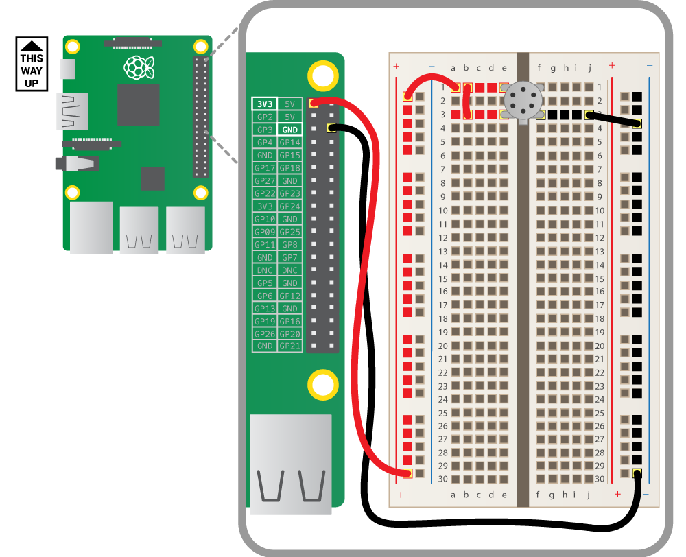

## Wire up the air quality sensor

This is the bottom view of the air quality sensor. The pin numbers have the following functions:

- Heater (-)
- Sensor electrode (-)
- Sensor electrode (+)
- Heater (+)

So there are two distinct circuits that we need to accommodate. First is the *heater* (pins 1 and 4) which is used to energise the air, and the other is the *sensor* itself (pins 2 and 3). The output (-) side of the sensor is where we will connect our resistors. Take the breadboard and push the four pins of the sensor into it, so that it straddles the central gap as shown below. You may need to bend the pins a little, but this will not harm the sensor. Ensure the little tab is in the same orientation as shown.

The sensor can run on 5 volts but we're going to run it on 3.3 volts here, since this is safer for use with a GPIO input. Use the jumper wires to make the orange connections shown above; this will supply 3.3 volts to pins 3 and 4 of the sensor (both positive electrodes). The colour of the wire you use doesn't matter. Next, connect the negative (-) terminal of the heater directly to ground as shown above by the black wires.

We still need to do something with the negative side of the sensor, row 1 in the top right corner of the breadboard.

