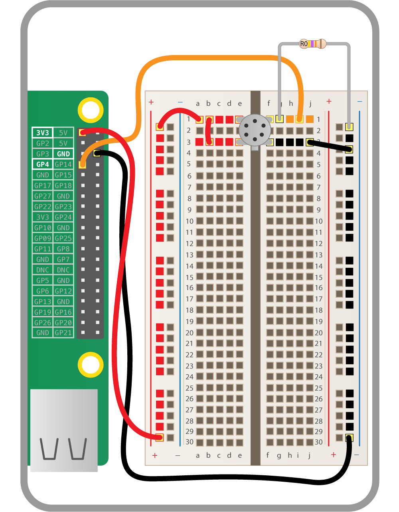

## Wire up the trigger pin

Shut the Raspberry Pi down, if it is not already turned off, by entering the following:

```bash
sudo halt
```

Unplug the power for now; we'll plug it back in again later.

Next, let's connect the output of the sensor to one of the GPIO pins: this will be the trigger pin which we will monitor in our code to see if a fart has occurred. Use GPIO 4 for this. Take a jumper wire and make the white connection shown below.



Next take a 47kΩ resistor (resistors are [colour coded](http://en.wikipedia.org/wiki/Electronic_color_code#Resistor_color-coding) to help you identify them) and connect it between the sensor output and ground as shown above. This will siphon off a portion of the voltage coming from the sensor output, to help bring it down to the 1.1 to 1.4 volt region of the GPIO threshold for our trigger pin. This single resistor is not going to be enough to get the job done though, so read on.

